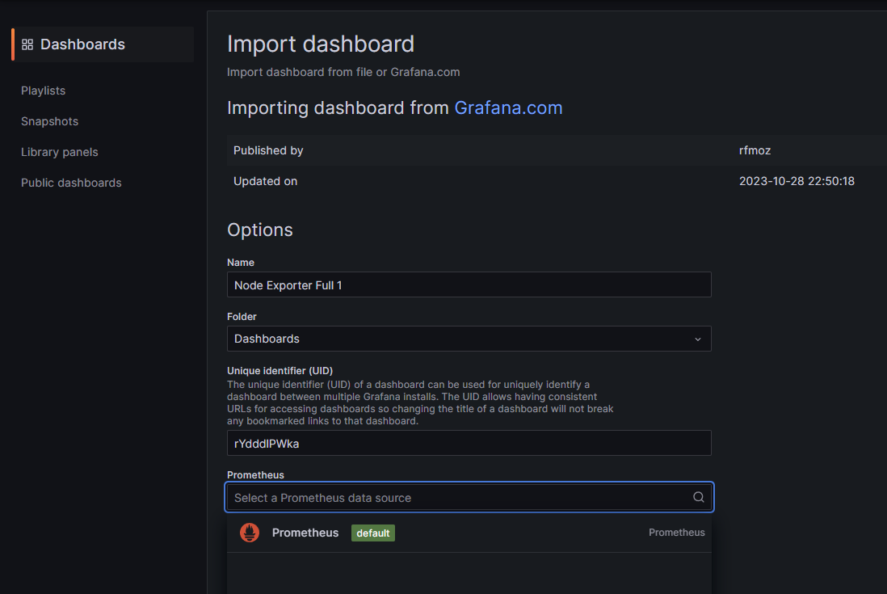

# Monitoring with Grafana

## Prerequisites
There is some setup to do before you can proceed with the lab. In this prerequisite step you will `clone` the GitHub repository that contains the Kubernetes manifests needed to deploy Prometheus and Grafana to an **OpenShift** cluster in the lab environment.

1. Use the `git clone` command to clone this repository:
   
   ```
   git clone https://github.com/ibm-developer-skills-network/ondaw-prometheus-grafana-lab.git
   ```

2. Finally, change into the ondaw-prometheus-grafana-lab folder:
   
   ```
   cd ondaw-prometheus-grafana-lab
   ```

## Deploy node exporters

1. Use the `oc create deployment` command to deploy 3 node exporters, named `node-exporter1`, `node-exporter2`, and `node-exporter3`, all listening on port 9100.
   
   ```
   oc create deployment node-exporter1 --port=9100 --image=bitnami/node-exporter:latest
   oc create deployment node-exporter2 --port=9100 --image=bitnami/node-exporter:latest
   oc create deployment node-exporter3 --port=9100 --image=bitnami/node-exporter:latest
   ```
3. Check that the pods are up and running with the following oc command:
   
   ```
   oc get pods
   ```

## Deploy Prometheus

In this step, you will confiugure and deploy Prometheus. While normally you would modify configuration files to configure Prometheus, this is not the case for Kubernetes. For a Kubernetes environment the proper appoach is to use a `ConfigMap`. This makes it easy to change the configuraton later. You will find the configuration files from which to make the `ConfigMap` in a folder named `./config`.

You will also need Kubernetes manifests to describe the Prometheus deployment and to link the `ConfigMap` with the Prometheus. These manifests can be found in the `./deploy` folder.

1. First, create a ConfigMap called `prometheus-config` that is needed by Prometheus from the `prometheus.yml` and the `alerts.yml` file in the `./deploy` folder.
   
   ```
   oc create configmap prometheus-config \
   --from-file=prometheus=./config/prometheus.yml \
   --from-file=prometheus-alerts=./config/alerts.yml
   ```

   > You should see a message that the prometheus-config was created.

2. Now deploy Prometheus using the deploy/prometheus-deployment.yaml deployment manifest.
   
   ```
   oc apply -f deploy/prometheus-deployment.yaml
   ```

   > You should see a message that the `prometheus-volume-claim`, `deployment.apps/prometheus`, and `service/prometheus` were all created.

3. Finally, use the oc command to check that the prometheus pod is running.
   
   ```
   oc get pods -l app=prometheus
   ```

   


## Deploy Grafana

Now that you have 3 node exporters to emit metrics, and Prometheus to collect them, it is time to add Grafana for dashboarding. You will deploy Grafana into OpenShift and create a route which will allow you to open up the Grafana web UI and work with it.

1. First, deploy Grafana using the `deploy/grafana-deployment.yaml` deployment manifest.
   
   ```
   oc apply -f deploy/grafana-deployment.yaml
   ```
   > You should see a message that both the grafana deployment and service have been created.

2. Next, use the `oc expose` command to expose the `grafana` service with an OpenShift `route`. Routes are a special feature of OpenShift that makes it easier to use for developers.
   
   ```
   oc expose svc grafana
   ```

   > Your should see the message: “*route.route.openshift.io/prometheus exposed*”

3. Use the following `oc patch` command to enable TLS and the `https://` protocol for the route.
   
   ```
   oc patch route grafana -p '{"spec":{"tls":{"termination":"edge","insecureEdgeTerminationPolicy":"Redirect"}}}'
   ```

4. Then use the oc get routes command to check the URL that the route was assigned. You will be able to interact with Grafana using this URL.
   
   ```
   oc get routes
   ```

   

5. Finally, use the `oc` command to check that the grafana pod is running.
   
   ```
   oc get pods -l app=grafana
   ```

   

## Log in to Grafana

Now that Prometheus and Grafana are deployed and running, it is time to configure Grafana. In order to do this, you will need the URL from the `route` that you created in the last step.

1. Use the `oc describe` command along with `grep` to extract the URL of the Requested Host for the `grafana route`:
   
   ```
   oc describe route grafana | grep "Requested Host:"
   ```

2. Copy the URL after the words “Requested Host:” to the clipboard and paste it into a new web browser window outside of the lab environment.
   
   

## Configure Grafana

Once you have logged in to Grafana, you can configure Prometheus as your datasource.

1. At the home page, select the `data sources` icon.
   
   

2. At the `Add data source` page select `Prometheus`.
   
   

3. On the `Prometheus` configuration page, set the Prometheus URL to `http://prometheus:9090` which is the name and port of the Prometheus service in OpenShift.
   
   

4. Scroll down to the bottom of the screen and click the **Save & test** button.
   
   

You should see a message, confirming that the data source is working:


## Create a Dashboard

Now you can create your first dashboard. For this lab, you will use a precreated template provided by Grafana Dashboard. This template is identified by the id `1860`.

1. On the Grafana homepage, click the `Dashboards` icon, and select `New + [Import]` from the menu to start creating the dashboard.
   
   

2. Next,enter the template identifier id `1860` in the space provided and click the `[Load]` button to import that dashboard from Grafana.
   
   

3. You will see the default name for the template, **Node Exporter Full**, displayed. You are allowed to change it if you want to. The change will be local and valid only for your instance.
   
   

4. At the bottom of the page, choose `Prometheus (Default)` as the data source and click `Import`.
   
   

## View the Dashboard

