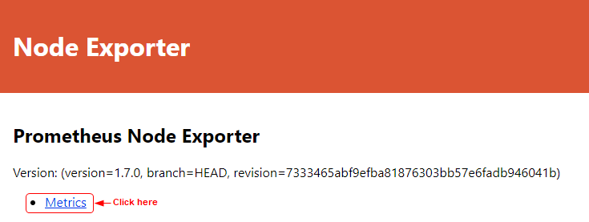

## Prometheus node exporter

The first thing you will need is some server nodes to monitor. You will start up three node exporters listening on port `9100` and forwarding to ports `9101`, `9102`, and `9103`, respectively. Each node will need to be started up individually.

```
docker compose up -d && docker compose logs -f
```

1. Check if the instance is running, which will launch the application on port `9101`:
2. You should see the Node Exporter page open up with a hyperlink to Metrics. These are the metrics the Prometheus instance is going to monitor.
   
   

   

Before you can start Prometheus, you need to create a configuration file called `prometheus.yml` to instruct Prometheus on which nodes to monitor.

In this step, you will create a custom configuration file to monitor the three node exporters running internally on the `monitor` network at `node-exporter1:9100`, `node-exporter2:9100`, and `node-exporter3:9100`, respectively. Then you will start Prometheus by passing it the configuration file to use.

1. Copy and paste the following configuration contents into the yaml file and save it:
   
   ```
   # my global config
   global:
    scrape_interval: 15s # Set the scrape interval to every 15 seconds. The default is every 1 minute.

    scrape_configs:
    - job_name: 'node'
        static_configs:
        - targets: ['node-exporter1:9100']
            labels:
            group: 'monitoring_node_ex1'
        - targets: ['node-exporter2:9100']
            labels:
            group: 'monitoring_node_ex2'
        - targets: ['node-exporter3:9100']
            labels:
            group: 'monitoring_node_ex3'
   ```

   > *Notice that while you access the node exporters externally on ports `9101`, `9102`, and `9103`, they are internally all listening on port `9100`, which is how Prometheus will communicate them on the `monitor` network.*

   Take a look at what this file is doing:

   * Globally, you set the `scrape_interval` to 15 seconds instead of the default of 1 minute. This is so that we can see results quicker during the lab, but the 1 minute interval is better for production use.
   * The `scrape_config` section contains all the jobs that Prometheus is going to monitor. These job names have to be unique. You currently have one job called `node`. Later we will add another to monitor a Python application.
   * Within each job, there is a `static_configs` section where you define the targets and define labels for easy identification and analysis. These will show up in the Prometheus UI under the Targets tab.
   * The targets you enter here point to the base URL of the service running on each of the nodes. Prometheus will add the suffix `/metrics` and call that endpoint to collect the data to monitor from. (For example, `node-exporter1:9100/metrics`)
  
## Open the Prometheus UI

1. Open the Prometheus web UI by navigate to
   
   ```
   http://localhost:9090
   ```

2. Next, in the Prometheus application, click **Status** on the menu and choose **Targets** to see which targets are being monitored.
   
   

3. View the status of all three node exporters.
   
   

4. Click **Graph** to return to the home page.
   
   

You are now ready to execute queries.

### Execute query

You are now ready to execute your first query. The first query you run will query the nodes for the total CPU seconds. It will show the graph as given in the image. You can observe the details for each instance by hovering the mouse over that instance.

1. Ensure you are on the Graph tab, and then copy-n-paste the following query and press the blue Execute button on the right or press return on your keyboard to run it. It will show the graph as given in the image. You can observe the details for each instance by hovering the mouse over that instance.
   
   ```
   node_cpu_seconds_total
   ```
2. Next, click **Table** to see the CPU seconds for all the targets in tabular format.
   
   

3. Now, filter the query to get the details for only one instance `node-exporter2` using the following query.
   
   ```
   node_cpu_seconds_total { instance="node-exporter2:9100" }
   ```

   

4. Finally, query for the connections each node has using this query.
   
   ```
   node_ipvs_connections_total
   ```

## Stop and observe

1. Stop the `node-exporter1` instance by running the following docker stop command and then switch back to the old terminal in which Prometheus is running.
   
   ```
   docker stop node-exporter1
   ```

2. Now go back to the Prometheus UI on your browser and check the targets by selecting the menu item **Status** -> **Targets**.
   
   

## Monitor your application

In order to see some results of monitoring, you need to generate some network traffic.

1. Make multiple requests to the three endpoints of the Python server you created in the previous task and observe these calls on Prometheus.
   
   ```
   curl localhost:8081
   curl localhost:8081/home
   curl localhost:8081/contact
   ```

   > Feel free to run these multiple times to simulate real network traffic.

2. Use the Prometheus UI to query for the following metrics.
   
   ```
   flask_http_request_duration_seconds_bucket
   flask_http_request_total
   process_virtual_memory_bytes
   ```

If you are interested in what other metrics are being emitted by your application, you can view all of the metrics that your application is emitting by opening the `/metrics` endpoint just like Prometheus does. Feel free to experiment by running queries against other metrics: